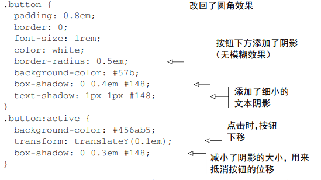

### CSS （cascade style sheet） 优先级顺序
- 看来源
  - 内联样式（也就是写在标签里面的，通常在浏览器可以直接输入查看）> 内部样式（style声明的或者外部引入的）
- 看选择器
  - id 选择器大于 class 选择器（包括属性和伪类）大于标签（类型）选择器。同类型看数量，同数量看先后
---
### 浏览器样式检查器的一些属性
- Layout，查看盒子模型的各项数据图示
- Computed，查看盒子模型的各项数据结果
- Compatibility,
- Changes,
- Fonts，列出当前元素的字体属性，包括Size，Line-Height，Spacing，Weight，Italic,(可以拖动控件调节)
- Animation,
---
### 相对单位 em 和 rem
- em 相对于当前元素字号大小的单位，如果当前元素字号也为em单位，则使用父元素的字号大小计算出当前元素font-size，再计算其他属性
- rem 相对于根元素font-size的单位，
- 最佳实践，使用 rem 设置font-size，使用 px 设置边框，其他属性用 em（容器宽度可以用百分比）
---
### 视口相对单位 vw, vh, vmin, vmax
- vw 代表浏览器显示页面窗口宽度的1%
- vh 代表浏览器显示页面窗口高度的1%
- vmin 代表浏览器显示页面窗口宽与高较小的那个的1%，可以用来设置占满全屏的元素
---
### 全局设置 border-box
- ```*,::before,::after { box-sizing: border-box; }```
- 直接全局设置可能会影响第三方组件，解决方案是根元素设置为 `border-box`, 然后其他元素都用 `box-sizing: inherit`;
- ```.third-party-component { box-sizing: content-box }``` 必要时选中第三方组件根元素，设为内容盒子
---
### float，将元素移动到容器的一侧
- 现在基本不用，使用更加直观可预测的flexbox,
- 为了维护一些老的代码，还是需要略微有些了解
- `clear: both`, 清除浮动，作用域包含浮动元素的容器的::after 上
---
### BFC 块级格式上下文(overflow: auto)
- 是网页的一块区域，元素基于这块区域进行布局
- 它可以将内部的内容和外部的上下文隔离开来
- 不会与BFC 外部的元素产生外边距折叠，浮动元素折叠
- 创建BFC 的方法，float: left或right; overflow: hidden/auto/scroll；display: inline-block，table-cell...很多; position: absolute/fixed
---
### flexbox 使用技巧
- `margin: auto`, 填满可以填满剩余空间
- flex:2/flex:1 和 flex:66.7%/flex:33.3%; 区别
  - 前者基本尺寸为0，对弹性子元素的content区域进行缩放，也就是总尺寸减去内边距外边距后的尺寸的分配比例
  - 后者是基本尺寸的2：1，对总尺寸减去元素的外边距然后进行分配（flex-basic的值可以来自于width, 所以保持一致性，这里设置的比例也是相对于元素的width(这个又根据弹性容器的盒子模型来计算)）
  - flex 布局示例 
---
### grid 布局
- `grid-template-columns: repeat(auto-fill, minmax(200px, 1fr))` 其中repeat的第一个参数，auto-fill 和 auto-fit 的区别在于，划分好容器内的网格后，剩余空间是否分配给子元素
- 优秀示例：
### img 容器内的图片
- `object-fit: fill/cover/contain` 分别适用于图片填充布满整个容器，放大图片，覆盖整个容器部分图片被裁剪，缩小图片使得容器完全包含图片
- `width: 100%` 占满父元素的空间
- 示例: 
### sticky 粘性元素
- 页面滚动到粘性元素设定的位置，粘性元素会停止滚动，但是继续往下滚动，粘性元素还是会随着页面滚动，因为它不会超出父级元素的范围。也就是说，当粘性元素的底部和父级元素的底部接触时，粘性元素会和父级元素一起滚动
---
### 阴影的设计使用
- 立体感设计：
  设置向外的渐变，点击后渐变改为向内
- 扁平化设计：
  没有渐变，点击后颜色稍微加深
- 时尚化设计: 
  设置文字阴影和按钮阴影，点击后按钮向下移动
---
### 混合模式（了解即可）
- 
---
### animation-fill-mode (了解即可)
- none: 默认值，动画执行前后，不会对元素应用任何样式
- forwards: 表示动画执行后，对元素保持结束时候的样式，
- backwards: 表示动画执行前延迟等待时，对元素应用开始时的样式
- both: 结合backwards 和 forwards, 动画开始执行前，应用动画开始时的样式，动画结束后，保持结束时的样式
###