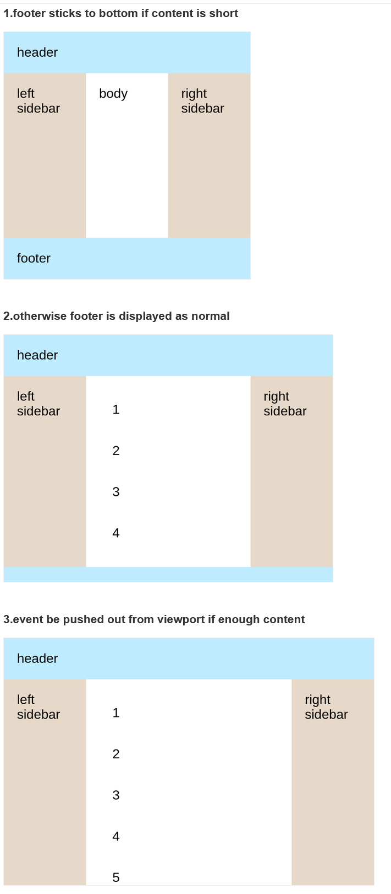

```html
<!DOCTYPE html>
<html lang="en">
  <head>
    <meta charset="UTF-8" />
    <meta name="viewport" content="width=device-width, initial-scale=1.0" />
    <title>Document</title>
  </head>
  <style>
.container {
  min-height: 100%;
  display: grid;
  grid-template-rows: 50px auto 50px;
  grid-template-columns: 100px auto 100px;
}

.footer, .header {
  grid-column: 1 / span 3;
}

  </style>
  <body>
<div class="container">
  <header class="header">header</header>
  <div class="left-sidebar">left sidebar</div>
  <div class="body">body</div>
  <div class="right-sidebar">right sidebar</div>
  <footer class="footer">footer</footer>
</div>
  </body>
</html>
```

图示：
